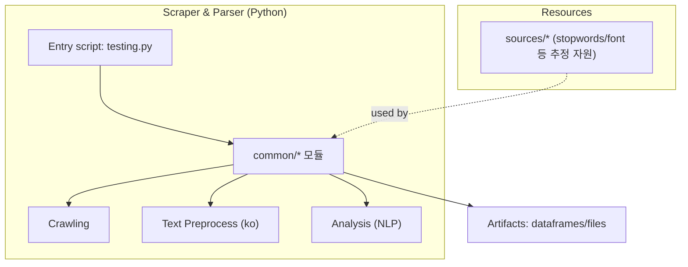

import NotionBookmark from '../../components/notion/NotionBookmark.astro';
import NotionCallout from '../../components/notion/NotionCallout.astro';
import NotionColumns from '../../components/notion/NotionColumns.astro';
import NotionToggle from '../../components/notion/NotionToggle.astro';

{/* This file is generated from Notion. Do not edit directly. */}

<figure class="notion-figure">
  
  <figcaption>Source: author's Notion note</figcaption>
</figure>

# Newsboy – 한국어 중심 웹 스크래핑·콘텐츠 분석 유틸리티

> 한줄 슬로건
> 
> “웹에서 텍스트를 긁고 (NLP로) 선명하게 읽는다.”

---

> 🎯 Executive Summary

- 문제: 한국어 웹 콘텐츠를 대량 수집·가공(NLP)하려는 개인/연구·학습자의 반복 작업 부담
- 해결: Python 기반 스크래핑 + 한국어 NLP(토픽 메타에 konlpy 명시) 모듈 구조로 단계별 처리
- 결과: 공개 자료에 KPI 수치 미기재

## 1. 배경·목표

- 사용자/페르소나: Python 사용자)로, 한국어 텍스트 수집·전처리 필요
- 범위(Out of scope): 배포형 서비스/웹 UI

## 2. 역할·스택·기간

- 역할/기여: 개인 프로젝트
- 스택: Python 100%, 
- 기간: 2024.6.20. - 2024.7.8.

## 3. 데모 &amp; 링크

- Demo: (없음)
- Repo: <a href={"https://github.com/MelonChicken/Newsboy"}>https://github.com/MelonChicken/Newsboy</a>
- 시연영상: <a href={"https://youtube.com/shorts/5YaNErJwAwA?feature=share"}>https://youtube.com/shorts/5YaNErJwAwA?feature=share</a>

## 4. 아키텍처 요약

- 다이어그램(개요)

- 데이터 흐름/외부 의존성: 스크래핑(웹) → 전처리/분석(NLP) → 산출물(데이터프레임/파일). 
- 배포/CI·CD/롤백: 릴리스/패키지/액션 미구성

## 5. 핵심 기능

1. 웹 스크래핑 파이프라인 — 한국어 중심 데이터 수집(토픽·언어 비중 근거)
    - 가치: 반복 수집 자동화로 실험·학습 데이터 확보
    - 엣지 케이스: 차단/리다이렉트/HTML 구조 변경 → 재시도·파서 분리
2. 텍스트 전처리·분석(NLP) — konlpy 토픽 메타 기반 한국어 처리
    - 가치: 토큰화/정규화 등 기본 파이프라인 가정
    - 엣지 케이스: 신조어/이모지/혼합문자 처리

## 6. 기술 결정(ADR 요약)

- 결론: Python 단일 스택 + 한국어 NLP(koNLPy 메타)
    - 버린 대안: 멀티언어 파이프라인/배포형 서비스 → 우선 개인에 초점
- 리스크 및 완화:
    - 크롤링 신뢰성/법적 이슈 → Robots/ToS 준수, 요청 간 대기, 예외·재시도
    - 한국어 품질 편차 → 사용자 사전/불용어 리스트 관리

## 7. 회고 &amp; 개선

- 잘된 점
    - 목적이 명확(한글 스크래핑·분석)해서 기획에 큰 어려움이 없었음
    - 폴더 분리로 역할을 폴더명을 통해 가늠이 가능해짐(<code>common/</code>, <code>sources/</code>, <code>test/</code>)
    - Python 단일 스택으로 학습/실험의 진입장벽 낮음
- 아쉬운 점
    - README/사용가이드·실행예시 부족
    - 테스트/샘플 데이터 공개 부족
    - 배포·자동화 파이프라인 부재
- 기술부채(우선순위/공수)
    1. README + Quickstart + 예제 노트북(상)
    2. 입력 어댑터 인터페이스화(상)
    3. 로깅·리트라이·중복제거 유틸(중) 
    4. 간단 CI(포맷/린트/테스트)(중)
        <figure class="notion-figure">
          
          <figcaption>Source: author's Notion note</figcaption>
        </figure>

